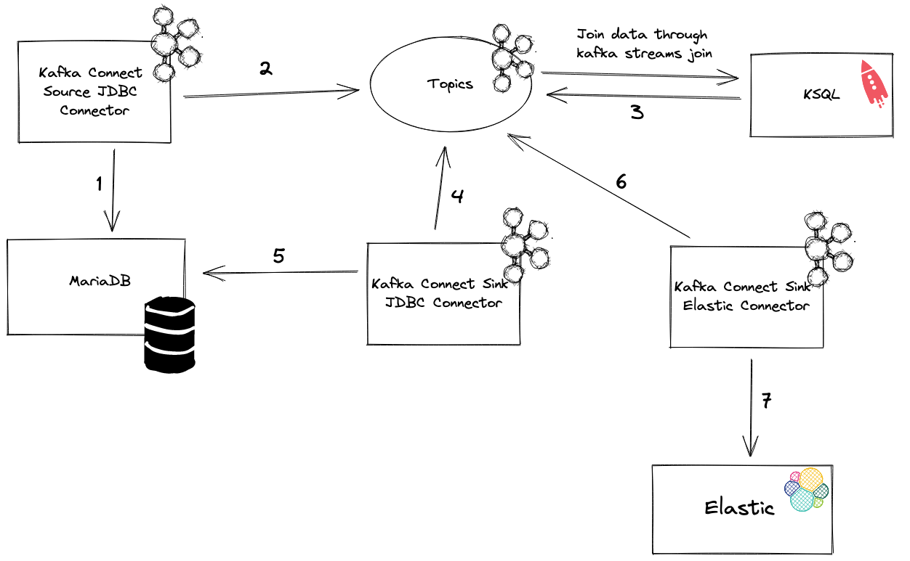

# KSQL - Connect Integration

## Introduction

This repo simulates a scenario in which data will be retrieved from a MariaDB and then, using both KSQL and Connect, they will be updated. The update was done by joining data ingested by _connect_ and events pushed in Kafka topics.

The use case has 2 main objects:

- devices (table on MariaDB, imported in kafka using Connect and transformed in Stream by KSQL)
- message (topic on Kafka, created as a Stream in KSQL)

Devices are stored in a database and, once the first trip (in the next 3 days) is done, KSQL and Connect will update the "is_active" column on the device table.



## Prerequisites

- docker
- docker-compose
- vscode (with [rest-client](https://marketplace.visualstudio.com/items?itemName=humao.rest-client) extension, needed for connectors creation by Kafka Connect REST APIs)

## 1. Start the environment

```
docker-compose up -d
```

Connect REST APIs will be exposed at [connect](http://localhost:8088), you can connect also to C3 at [control-center](http://localhost:9021).

## 2. Create source connector

Open the file `source.jdbc.connector.http` with VSCode and send the request for creating the connector.

## 3. Run KSQL Script

```
docker exec ksqldb-cli bash -c "echo RUN SCRIPT /ksql/statements.ksql | ksql http://ksqldb-server:8088"
```

## 4. Create sink connector

Open the file `sink.jdbc.connector.http` with VSCode and send the request for creating the connector.

## 5. Create sink connector

Open the file `sink.elastic.connector.http` with VSCode and send the request for creating the connector.
